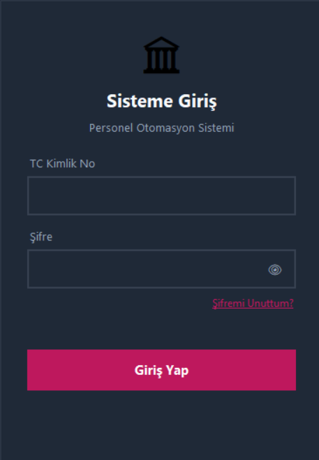
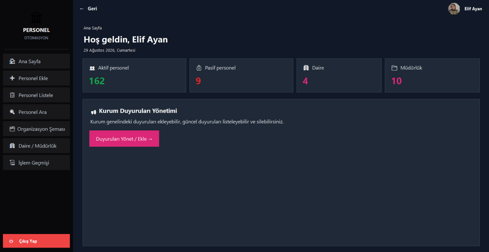
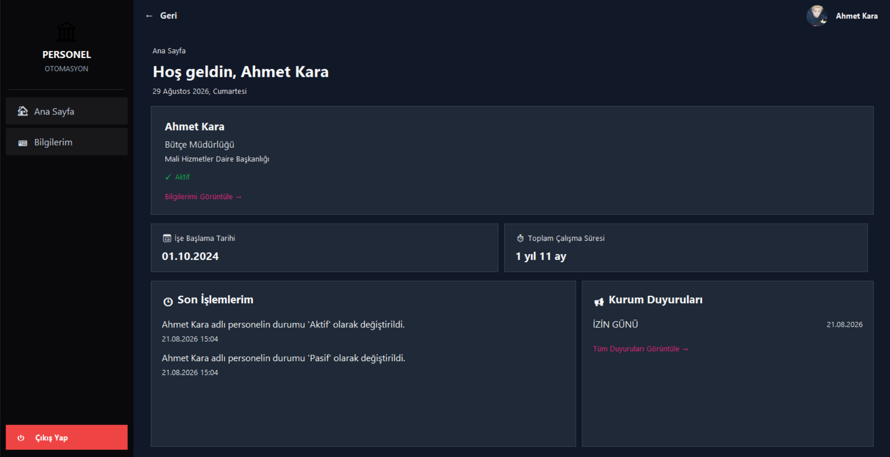
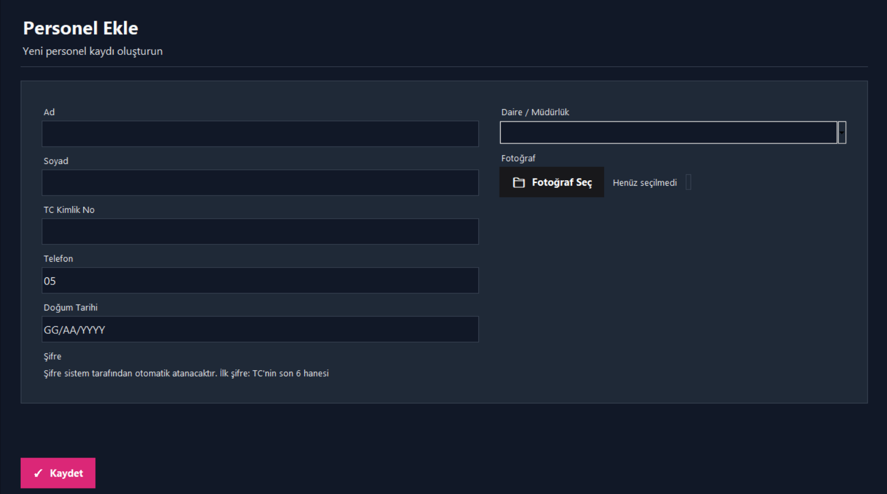
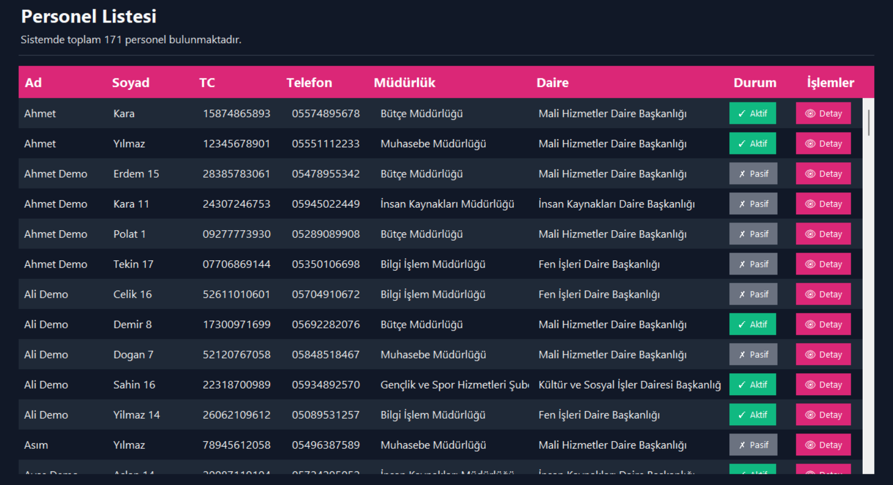
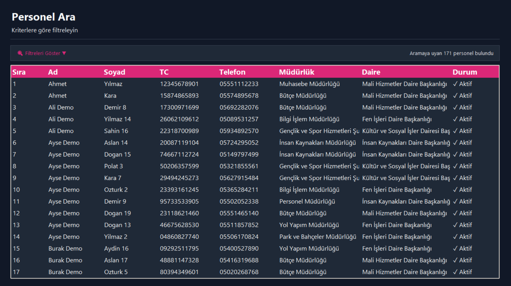
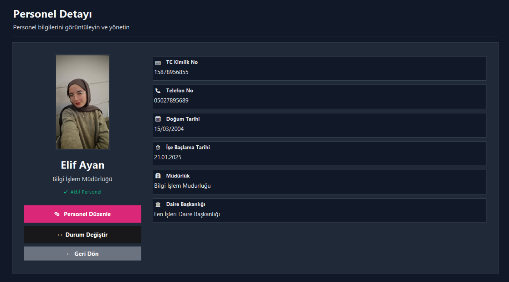
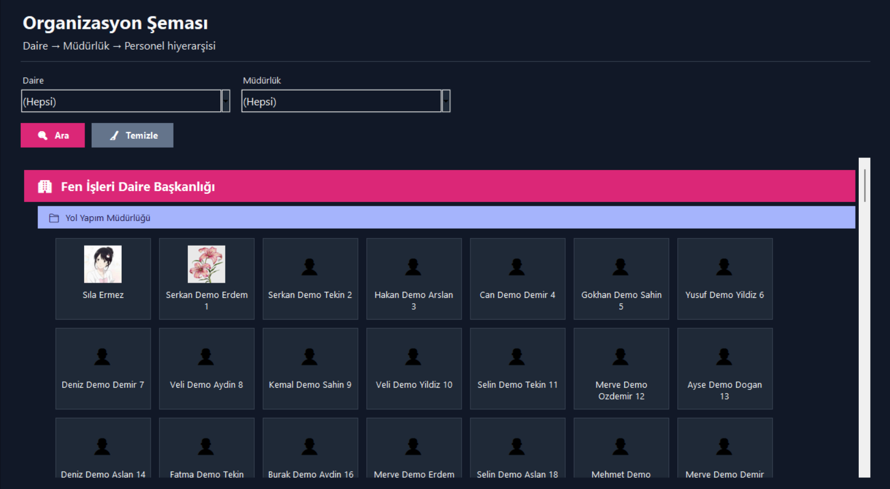
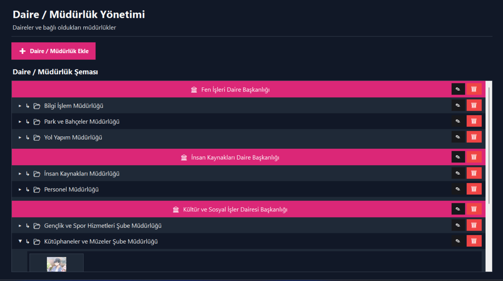

# Personel Otomasyon Sistemi - Modüler Yapı

## Dosya Yapısı

```
personel_otomasyon/
├── main_app.py                    # Ana uygulama (giriş ekranı + ana menü + oturum yönetimi)
├── config.py                      # Renkler, fontlar, veritabanı bağlantısı, OTURUM bilgisi
├── utils.py                       # Ortak yardımcı fonksiyonlar (frame/sayfa/form/validasyon)
├── sidebar.py                     # Sidebar butonları
├── log.py                         # İşlem loglama (log_ekle)
├── pages_giris.py                 # (Eski) giriş ekranı taslağı — main_app.py içine taşındı, kullanılmıyor
│
├── pages_home.py                  # Ana Sayfa
├── pages_personel_ekle.py         # Personel Ekle
├── pages_personel_listele.py      # Personel Listele
├── pages_personel_duzenle.py      # Personel Düzenle (listeleme üzerinden açılır)
├── pages_personel_ara.py          # Personel Ara / Detay
├── pages_organizasyon.py          # Organizasyon Şeması
├── pages_daire_mudurluk.py        # Daire / Müdürlük Yönetimi
├── pages_duyurular.py             # Duyuru Yönetimi / Listeleme / Detay (Ana Sayfa üzerinden açılır)
└── pages_loglar.py                # Log Kayıtları
```

> **Not:** Sayfa dosyaları ayrı bir `pages/` klasöründe değil, proje kök dizininde `pages_` ön ekiyle birlikte duruyor. Tüm dosyalar **aynı klasörde** olmalı.

## Sistemden Görseller

| Giriş Ekranı |
|:---:|
|  |

| Admin Ekranı | Personel Ekranı |
|:---:|:---:|
|  |  |

| Personel Ekle | Personel Listele |
|:---:|:---:|
|  |  |

| Personel Ara | Personel Detay |
|:---:|:---:|
|  |  |

| Organizasyon Şeması | Daire Müdürlük |
|:---:|:---:|
|  |  |

## Dosya Açıklamaları

### config.py
- **RENK** dictionary — tüm renk paleti
- **FONT_BASLIK, FONT_ALT_BASLIK, FONT_NORMAL, FONT_BUTON, FONT_KUCUK** — font sabitleri
- **DB_BAGLANTI_STR** — veritabanı bağlantı stringi
- **OTURUM** — aktif kullanıcı oturum bilgisi (dictionary)
- **db_baglan()** — veritabanı bağlantısı açan fonksiyon

### utils.py
- **set_sag_frame() / set_geri_btn()** — ortak referansları ayarlar
- **frame_temizle()** — sağ tarafı temizle
- **sayfa_basligi()** — başlık bloğu oluştur
- **form_alani()** — Entry + Label
- **yuvarlak_buton()** — özel buton stili
- **kart_frame()** — form kartı
- **stil_kur()** — ttk stillerini yapılandırır
- **tc_kontrol(), telefon_kontrol()** — validasyon fonksiyonları
- **mudurluk_secenekleri_getir(), daire_listesi_getir()** — veritabanından seçenek listeleri
- **sayfa_git(), geri_git(), geri_buton_guncelle()** — sayfa geçişi / geri gitme geçmişi yönetimi

### sidebar.py
- **create_sidebar()** — sidebar'ı oluşturur, callbacks dictionary'sini butonlara bağlar
- **sidebar_buton()** — sidebar buton stili

### log.py
- **log_ekle(hedef_id, yapan_id, aciklama)** — işlem kayıtlarını veritabanına yazar (personel ekle/düzenle gibi işlemlerde çağrılır)

### main_app.py
- **login_screen()** — giriş ekranı (TC + şifre ile giriş)
- **sifre_sifirla_penceresi_ac()** — şifre sıfırlama penceresi
- **ana_menu_ac()** — ana menüyü açar, sidebar'ı ve callbacks'i kurar
- **cikis_yap()** — oturumu kapatıp giriş ekranına döner

### pages_*.py
Her sayfa kendi modülünde:
- Global değişkenler
- Yardımcı fonksiyonlar
- Ana fonksiyon: `[sayfa_adi]_goster(sag_frame_ref, ...)`

Bazı sayfalar birbirini fonksiyon içinde (`from pages_x import y`) çağırır — örneğin `pages_home.py`, duyuru sayfalarını gerektiğinde içeriden import eder; `pages_personel_listele.py` düzenleme sayfasını (`pages_personel_duzenle`) açar.

## Nasıl Kullanılır?

### 1. Yeni Sayfa Eklemek

Kök dizine **pages_yeni_sayfa.py** dosyası oluşturun:

```python
from config import RENK, FONT_NORMAL, db_baglan
from utils import frame_temizle, sayfa_basligi, yuvarlak_buton

def yeni_sayfa_goster(sag_frame_ref):
    frame_temizle()
    sayfa_basligi(sag_frame_ref, "Başlık", "Alt Yazı")
    # Sayfa içeriği buraya
```

### 2. Renkler/Fontları Değiştirmek

**config.py** dosyasını düzenleyin:

```python
RENK = {
    "birincil": "#YENI_RENK",
    ...
}
```

### 3. Sidebar Butonları Değiştirmek

**main_app.py** dosyasında `ana_menu_ac()` içindeki `callbacks` dictionary'sini güncelleyin:

```python
callbacks = {
    'ana_sayfa': lambda: sayfa_git(pages_home.ana_sayfa_goster, sag_frame, tam_ad_str),
    'yeni_sayfa': lambda: sayfa_git(pages_yeni_sayfa.yeni_sayfa_goster, sag_frame),
    ...
}
```

Mevcut sidebar anahtarları: `ana_sayfa`, `bilgilerim`, `personel_ekle`, `personel_listele`, `personel_ara`, `organizasyon`, `daire_mudurluk`, `loglar`, `cikis`.

## Avantajları

✅ **Kolay Bakım**: Her sayfa kendi dosyasında
✅ **Tekrar Kullanılabilir**: Ortak fonksiyonlar utils.py'de
✅ **Hızlı Güncelleme**: Bir dosya değiştirmek diğerini etkilemez
✅ **Temiz Kod**: Dosyalar arası bağımlılık minimize
✅ **Ölçeklenebilir**: Yeni sayfalar eklemek kolay
✅ **İzlenebilirlik**: log.py sayesinde personel işlemleri kayıt altında

## Bağımlılıklar

```bash
pip install pillow pyodbc tkcalendar
```

## İlk Çalıştırma

```bash
python main_app.py
```

Giriş ekranında test hesabı (kurulum.md'de belirtilen):
- **TC**: 12345678901
- **Şifre**: 123456

---

**Not**: Tüm dosyalar aynı klasörde ve birlikte çalışmalıdır. Import yapısını değiştirmeyin. `pages_giris.py` şu an aktif olarak kullanılmıyor (giriş ekranı mantığı `main_app.py` içine taşınmış), silmeden önce başka bir yerde referans olmadığından emin olun.
